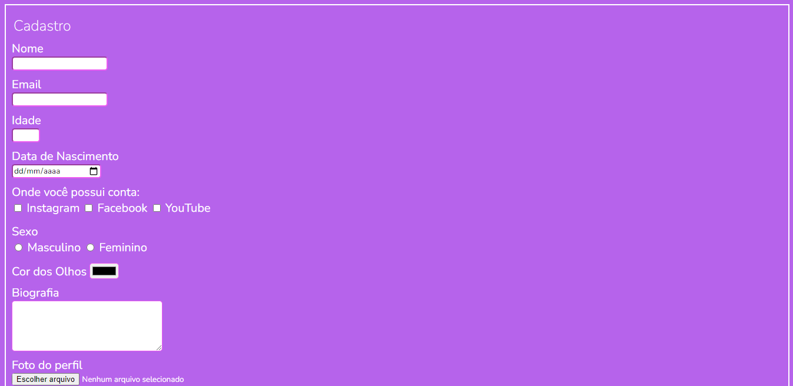

# Formulário-Estilizado

> Esse formulário foi desenvolvido inicialmente com HTML e posteriormente estilizado com CSS.

### Ajustes e melhorias

## 🤝 Colaboradores

Esse projeto foi desenvolvido individualmente.

<table>
  <tr>
    <td align="center">
      <a href="#">
         
        
          <b>Marcelle Marichal</b>
        
      </a>
    </td>
</table>

[⬆ Voltar ao topo](#Formulário-Estilizado) 
